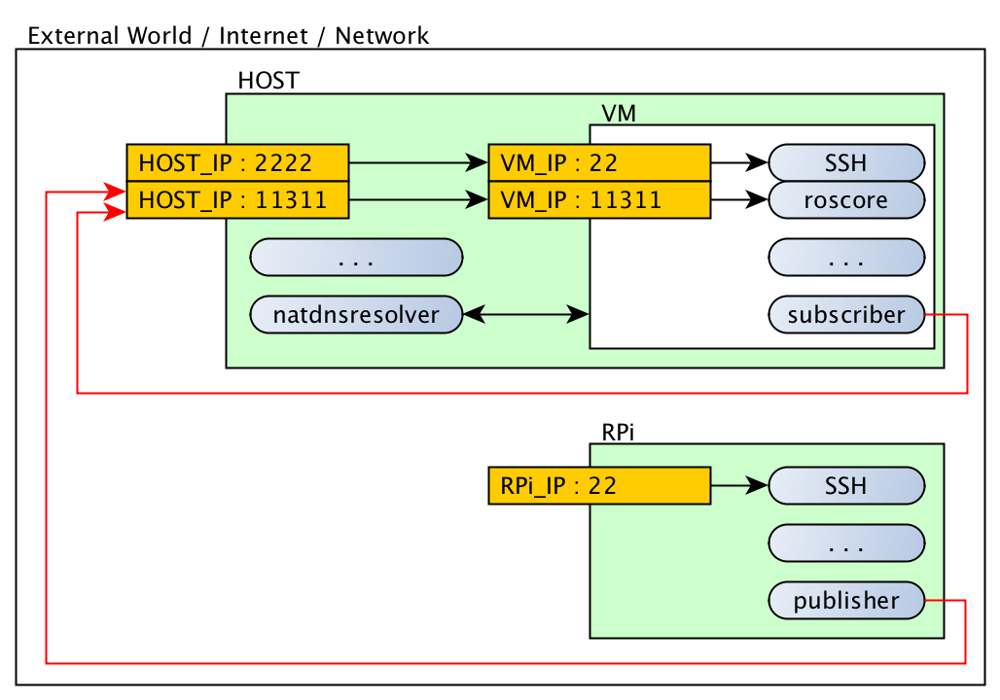

# ROS and remote nodes

When all previous steps are followed the setup should currently be able to:
- (cross) compile aribtrary c(++)-code
- (cross) compile OpenCV code 
- (cross) compile ROS code
- Run the native-compiled code in the VM
- Run the cross-compiled code on the RPi
- Update and synchronise the RPi
- Call OpenCV and ROS functions from Python
- Start/Stop ROS-nodes on both the VM and RPi

The next step is to setup extend the communication functions between the RPi and VM, such that we can run `roscore` in the VM and connect a node from the RPi. 

# ROS_MASTER_URI

ROS nodes connect to a master (`roscore`) via a tcp-connection. This allows a ROS system to have external nodes, hence we should be able to connect the RPi to our VM. 

Unfortunally there is a challenge: the VM is configured to be attached to the NAT, therefore it is not visible by any device in the network except the `HOST~$`. As a result, the RPi is cannot detect the VM and hence cannot connect to the ROS-master (`roscore`) running in the VM.

The nodes in a ROS system connect to an IP address by communicating with a specific port (by default 11311). When the calls to this port on the `HOST~$` are forwarded to our VM and the ROS-master is set to the ip-address of the `HOST~$` we can circumvent this problem and have external nodes communicating with the RPi. The setup then becomes:



- `HOST` has an IP named `HOST_IP`
- `HOST` forwards port 2222 to 22 in the VM (see [Installation](01-setup.md#installation))
- `HOST` forwards port 11311 to 11311 in the VM
- `VM` has a (local) IP named `VM_IP`. This IP is only accessible by the `HOST`
- `VM` runs SSH at port 22
- `VM` runs `roscore` at port `11311`.
- `VM` runs internal a ROS-node called `subscriber` which connects to `HOST_IP`:11311 (and therefore `roscore`)
- `VM` communicated with the `natdnsresolver` of the host in order to resolve dns-names such as `rpizw-hessel.local`.
- `RPi` has an IP named `RPi_IP`
- `RPi` runs SSH at port 22
- `RPi` runs internal a ROS-node called `publisher` which connects to `HOST_IP`:11311 (and therefore `roscore`)
- `HOST` and `RPi` are connected to the same network and are able to connect to each other.

## HOST-VM Port forwarding

In a similar manner as the SSH-setting (see [Installation](01-setup.md#installation)), a forward rule in VirtualBox needs to be set. After selecting the VM in VirtualBox:

1. Machine > Settings > Network > Advanced > Port Forwarding > New Rule       
    - Name: ROS_MASTER
    - Protocol: TCP
    - Host IP: (leave empty)
    - Host Port: 11311
    - Guest IP: (leave empty)
    - Guest Port: 11311
    
# Compilation
    
1. Compile for VM
    ```
    XCS~$ source ~/rpicross_notes/scripts/ros-native
    XCS~$ mkdir -p ~/build/ros/chatter
    XCS~$ cd ~/build/ros/chatter
    XCS~$ cmake ~/rpicross_notes/ros/chatter
    XCS~$ make
    ```

1. Compile for RPi
    ```
    XCS~$ source ~/rpicross_notes/scripts/ros-cross
    XCS~$ mkdir -p ~/ros/chatter_cross
    XCS~$ cd ~/ros/chatter_cross
    XCS~$ cmake \
        -DCMAKE_TOOLCHAIN_FILE=/home/pi/rpicross_notes/rpi-generic-toolchain.cmake \
        ~/rpicross_notes/ros/chatter
    XCS~$ make
    XCS~$ ~/rpicross_notes/scripts/sync-ros.sh
    ```
    
# Testing

1. First we need to determine the (external) IP (or hostname) of the `HOST~$` on which the VM is active. This is the IP on which the ROS-master will be reachable. When using an unix system, the hostname can be determined by:
    ```
    HOST~$ hostname
      Hessels-MacBook-Pro.local
    ```
    > While the IP of the host can also be used, in different networks different IPs might be active. Using the hostname of the `HOST~$` eliminates this potential issue.
    
1. Open three terminals in the VM:
    1. Source ROS-files and start `roscore`
        ```
        XCS~$ source ~/rpicross_notes/scripts/ros-native <hostname> <rpiname>
        XCS~$ roscore
        ```
        > The values `<hostname>` and `<rpiname>` need to be set in order for the RPi to connect properly to the VM via the HOST. This scripts fetches the IP of `<hostname>`, updates `ROS_MASTER_URI` locally, sends the update via `~/ros/rossetup-rpi` to `<rpiname>` and finally sources ROS files on the VM. For my setup the full command is:
        ```
        XCS~$ source ~/rpicross_notes/scripts/ros-native Hessels-MacBook-Pro.local rpizero-local
        ```
        > Note that `roscore` complains about the IP of `ROS_MASTER_URI` as it differs from the IP of the VM. More about this in issue #7 .

    1. After starting ROS, start the subscriber-node
        ```
        XCS~$ source ~/rpicross_notes/scripts/ros-native <hostname>
        XCS~$ rosrun chatter subscriber
        ```
        > Note that we do not need to update the RPi anymore. 
        
    1.  Start publisher on rpi       
        ```
        XCS~$ ssh rpizero-local
        RPI~$ source ~/ros/rossetup-rpi
        RPI~$ rosrun chatter publisher
        ```
        > The contents of `~/ros/rossetup-rpi` are created by copying and adapting `~/rpicross_notes/ros/rossetup-rpi` in the VM.
        
1. When succesfull, you should see:
    1. Publisher (RPi):
        ```
        RPI~$ rosrun chatter publisher 
          [ INFO] [1490361500.794854734]: hello world 0
          [ INFO] [1490361500.894476970]: hello world 1
          [ INFO] [1490361500.994248202]: hello world 2
          [ INFO] [1490361501.094246431]: hello world 3
          [ INFO] [1490361501.194246659]: hello world 4
          [ INFO] [1490361501.294338885]: hello world 5
          [ INFO] [1490361501.394404112]: hello world 6
          [ INFO] [1490361501.494347342]: hello world 7
          [ INFO] [1490361501.594348570]: hello world 8
          ...
        ```
    1. Subscriber (VM):
        ```
        XCS~$ rosrun chatter subscriber
          [ INFO] [1490361501.387607575]: I heard: [hello world 5]
          [ INFO] [1490361501.486619994]: I heard: [hello world 6]
          [ INFO] [1490361501.588621491]: I heard: [hello world 7]
          [ INFO] [1490361501.688693481]: I heard: [hello world 8]
          ...
        ```
     > Note that some packages are lost..

# Simplify life

It can become quite tedious to constantly `source` the ros-files. Luckily we can do this by adding the `source` command to `~/.bashrc`. Upon a ssh-call, `~/.bashrc` is loaded by the unix OS, hence the ROS binairies will be sourced automatically.

1. Add source-command to `~/.bashrc` in the VM
    ```
    XCS~$ nano ~/.bashrc
    ```
    
    Add the following to the bottom of the file
    ```
    # Load ROS biniaries and setup ROS_MASTER_URI
    source ~/rpicross_notes/scripts/ros-native Hessels-MacBook-Pro.local
    ```
1. Add source-command to `~/.bashrc` on the RPi
    ```
    XCS~$ ssh rpizero-local
    RPI~$ nano ~/.bashrc
    ```
    
    Add the following to the bottom of the file
    ```
    # Load ROS biniaries
    source ~/ros/rossetup-rpi
    ```
    
So, the steps to execute the example become:

1. Open three terminals in the VM:
    1. Start ros    
        ```
        XCS~$ roscore
        ```
        > If `ROS_MASTER_URI` has changed, or the RPi has not yet been configured, an initial call before `roscore` is required:
        ```
        XCS~$ source ~/rpicross_notes/scripts/ros-native Hessels-MacBook-Pro.local rpizero-local
        XCS~$ roscore
        ```
        
    1. Start subscriber in the second terminal
        ```
        XCS~$ rosrun chatter subscriber
        ```
        
    1.  Start publisher on RPi       
        ```
        XCS~$ ssh rpizero-local
        RPI~$ rosrun chatter publisher
        ```
